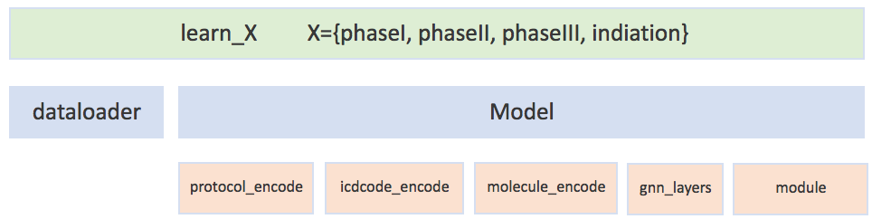

# HINT: Hierarchical Interaction Network for Predicting Clinical Trial Approval Probability

## Table Of Contents 

- Installtion
  * Setup 
  * Activate 
- Raw Data 
- Data Preprocessing 
- Benchmark Dataset
- Learn
- Contact 

--- 

## 1. Download code repo

```bash 

git clone git@github.com:futianfan/clinical-trial-outcome-prediction.git

cd clinical-trial-outcome-prediction 

mkdir -p data save_model figure

```


## Installation

### 1.1 Setup conda environment
```bash
conda env create -f conda.yml
```
An alternative way is to build conda environment step-by-step.  
```bash
conda create -n predict_drug_clinical_trial python==3.7 
conda activate predict_drug_clinical_trial 
conda install xxxx 
pip install xxxx==yyy
```

For example, it uses `conda` or `pip` to install the required packages.
```bash 
conda install -c rdkit rdkit 
pip install torch
```

Both may take a long time. 

### 1.2 Activate conda environment
```bash
conda activate predict_drug_clinical_trial
```


## 2. Raw Data 

- output
  - `./raw_data`: store all the xml files for all the trials (identified by NCT ID).  
  - `./trialtrove/trial_outcomes_v1.csv`  

### Download the data
```bash 
mkdir -p raw_data
cd raw_data
wget https://clinicaltrials.gov/AllPublicXML.zip
```
It is downloaded from [ClinicalTrial.gov](https://clinicaltrials.gov/AllPublicXML.zip). 
It contains 348,891+ clinical trial records. The data size grows with time because more clinical trial records are added. 
It describes many important information about clinical trials, including NCT ID (i.e.,  identifiers to each clinical study), disease names, drugs, brief title and summary, phase, criteria, and statistical analysis results.  


### unzip the ZIP file 
```bash 
unzip AllPublicXML.zip
cd ../
```
The unzipped file occupies 8.6+G. Please make sure you have enough space. 


## 3. Data Preprocess 


### 3.1 Collect all the NCTIDs.
- input
  - `raw_data/`: raw data, store all the xml files for all the trials (identified by NCT ID).   

- output
  - `data/all_xml`: store NCT IDs for all the xml files for all the trials.  

```bash
find raw_data/ -name NCT*.xml | sort > data/all_xml
```
The current version has 348,891 trial IDs. 


### 3.2 diseaes -> icd10 

- description

  - The diseases in ClinicalTrialGov are described in natural language. 

  - On the other hand, [ICD-10](https://en.wikipedia.org/wiki/ICD-10) is the 10th revision of the International Statistical Classification of Diseases and Related Health Problems (ICD), a medical classification list by the World Health Organization (WHO). It leverages the hierarchical information inherent to medical ontologies. 

  - We use [ClinicalTable](https://clinicaltables.nlm.nih.gov/), a public API to convert disease name (natural language) into ICD-10 code. 

- input 
  - `raw_data/ ` 
  - `data/all_xml`   

- output
  -	`data/diseases.csv ` 
```bash 
python src/collect_disease_from_raw.py
```

<details>
  <summary>Click here for the code!</summary>

```python
def get_icd_from_nih(name):
  prefix = 'https://clinicaltables.nlm.nih.gov/api/icd10cm/v3/search?sf=code,name&terms='
  name_lst = normalize_disease(name)
  for name in name_lst:
    url = prefix + name 
    response = requests.get(url)
    text = response.text 
    if text == '[0,[],null,[]]':
      continue  
    text = text[1:-1]
    idx1 = text.find('[')
    idx2 = text.find(']')
    codes = text[idx1+1:idx2].split(',')
    codes = [i[1:-1] for i in codes]
    return codes 
  return None 
```

</details>

### 3.3 drug -> SMILES 

- description

  - The drugs in ClinicalTrialGov are described in natural language. 

  - [DrugBank](https://go.drugbank.com/) contains rich information about drugs. 

  - We use [DrugBank](https://go.drugbank.com/) to get the molecule structures ([SMILES](https://en.wikipedia.org/wiki/Simplified_molecular-input_line-entry_system), simplified molecular-input line-entry system) of the drug. 

- input
  - `data/drugbank_drugs_info.csv `  

- output
  - `data/drug2smiles.pkl `  

```bash
python src/drug2smiles.py 
```


### 3.4 Aggregation

- inclusion criteria 
  - study-type is interventional 
  - intervention-type is drug
  - p-value in primary-outcome is available
  - disease codes are available 
  - drug molecules are available 
  - eligibility criteria are available


- exclusion criteria 
  - study-type is observational 
  - intervention-type is surgery, biological, device
  - p-value in primary-outcome is not available
  - disease codes are not available 
  - drug molecules are not available 
  - eligibility criteria are not available


- input    
  - `data/diseases.csv ` 
  - `data/drug2smiles.pkl`  
  - `data/all_xml ` 
  - `trialtrove/*`       


- output 
  - `data/raw_data.csv` (17,592 trials)

```bash
grep ^NCT data/raw_data.csv | wc -l
```

The csv file contains following features:

* `nctid`: NCT ID, e.g., NCT00000378, NCT04439305. 
* `status`: `completed`, `terminated`, `active, not recruiting`, `withdrawn`, `unknown status`, `suspended`, `recruiting`. 
* `why_stop`: for completed, it is empty. Otherwise, the common reasons contain `slow/low/poor accrual`, `lack of efficacy`
* `label`: 0 (failure) or 1 (success).  
* `phase`: I, II, III or IV. 
* `diseases`: list of diseases. 
* `icdcodes`: list of icd-10 codes.
* `drugs`: list of drug names
* `smiless`: list of SMILES
* `criteria`: egibility criteria 


```bash
python src/collect_raw_data.py | tee data_process.log 
```


<p align="center"></p>


## 4. TOP: Trial Outcome Prediction benchmark Dataset 


### 4.1 Data Split 

- Split criteria
  - phase I: phase I trials, augmented with phase IV trials as positive samples. 
  - phase II: phase II trials, augmented with phase IV trials as positive samples.  
  - phase III: phase III trials, augmented with failed phase I and II trials as negative samples and successed phase IV trials as positive samples. 
  - indication: trials that fail in phase I or II or III are negative samples. Trials that pass phase III or enter phase IV are positive samples.  

- input
  - `data/raw_data.csv` 


- output: 
  - `data/phase_I_{train/valid/test}.csv` 
  - `data/phase_II_{train/valid/test}.csv` 
  - `data/phase_III_{train/valid/test}.csv` 
  - `data/indication_{train/valid/test}.csv` 


```bash
python src/data_split.py 
```


### 4.2 ICD-10 code hierarchy 

- input
  - `data/raw_data.csv` 

- output: 
  - `data/icdcode2ancestor_dict.pkl` 


```bash 
python src/icdcode_encode.py 
```

### 4.3 sentence embedding 


- input
  - `data/raw_data.csv` 

- output: 
  - `data/sentence2embedding.pkl` 


```bash 
python src/protocol_encode.py 
```


### 4.4 Data Statistics 

| Dataset  | \# Train | \# Valid | \# Test | \# Total | Split Date |
|-----------------|-------------|-------------|------------|-------------|------------|
| Phase I |  1028  |  146  |  295  |   1469  |  08/13/2014  | 
| Phase II | 2667 |  381 | 762  |   3810  |  03/20/2014  | 
| Phase III |  4286  |  612  |  1225 |  6123  |  04/07/2014  | 
| Indication |  3767  |  538  |  1077   |  5382  |  05/21/2014  | 

We use temporal split, where the earlier trials (before split date) are used for training and validation, the later trials (after split date) are used for testing. The train:valid:test ratio is 7:1:2. 


<p align="center"></p>


## 5. Learn and Inference 

After processing the data, we learn the Hierarchical Interaction Network (HINT) on the following four tasks. The empirical results are given for reference. 


### 5.1 Phase I Prediction

```bash
python src/learn_phaseI.py
```

<details>
  <summary>Click here for the code!</summary>

```python

## 1. import 
## 2. input & hyperparameter
## 3. pretrain 
## 4. 'dataloader, model build, train, inference'
################################################


## 1. import 
import torch, os
torch.manual_seed(0) 
from dataloader import csv_three_feature_2_dataloader, generate_admet_dataloader_lst, csv_three_feature_2_complete_dataloader
from molecule_encode import MPNN, ADMET 
from icdcode_encode import GRAM, build_icdcode2ancestor_dict
from protocol_encode import Protocol_Embedding
from model import Interaction, HINT_nograph, HINT
# device = torch.device("cuda:0")
device = torch.device("cpu")


## 2. input & hyperparameter

base_name = 'phase_I' 
datafolder = "data"

train_file = os.path.join(datafolder, base_name + '_train.csv')
valid_file = os.path.join(datafolder, base_name + '_valid.csv')
test_file = os.path.join(datafolder, base_name + '_test.csv')


# # ## 3. pretrain 
mpnn_model = MPNN(mpnn_hidden_size = 50, mpnn_depth=3, device = device)

admet_model_path = "save_model/admet_model.ckpt"
if not os.path.exists(admet_model_path):
  admet_dataloader_lst = generate_admet_dataloader_lst(batch_size=32)
  admet_trainloader_lst = [i[0] for i in admet_dataloader_lst]
  admet_testloader_lst = [i[1] for i in admet_dataloader_lst]
  admet_model = ADMET(molecule_encoder = mpnn_model, 
            highway_num=2, 
            epoch=3, 
            lr=5e-4, 
            weight_decay=0, 
            save_name = 'admet_')
  admet_model.train(admet_trainloader_lst, admet_testloader_lst)
  torch.save(admet_model, admet_model_path)
else:
  admet_model = torch.load(admet_model_path)


## 4. dataloader, model build, train, inference
train_loader = csv_three_feature_2_dataloader(train_file, shuffle=True, batch_size=32) 
valid_loader = csv_three_feature_2_dataloader(valid_file, shuffle=False, batch_size=32) 
test_loader = csv_three_feature_2_dataloader(test_file, shuffle=False, batch_size=32) 
test_complete_loader = csv_three_feature_2_complete_dataloader(test_file, shuffle=False, batch_size = 32)

icdcode2ancestor_dict = build_icdcode2ancestor_dict()
gram_model = GRAM(embedding_dim = 50, icdcode2ancestor = icdcode2ancestor_dict, device = device)
protocol_model = Protocol_Embedding(output_dim = 50, highway_num=3, device = device)


hint_model_path = "save_model/" + base_name + ".ckpt"
if not os.path.exists(hint_model_path):
  model = HINT(molecule_encoder = mpnn_model, 
       disease_encoder = gram_model, 
       protocol_encoder = protocol_model,
       device = device, 
       global_embed_size = 50, 
       highway_num_layer = 2,
       prefix_name = base_name, 
       gnn_hidden_size = 50,  
       epoch = 5,
       lr = 1e-3, 
       weight_decay = 0, 
      )
  model.init_pretrain(admet_model)
  model.learn(train_loader, valid_loader, test_loader)
  model.bootstrap_test(test_loader)
  torch.save(model, hint_model_path)
else:
  model = torch.load(hint_model_path)
  model.bootstrap_test(test_loader)

```

</details>

### 5.2 Phase II Prediction

```bash
python src/learn_phaseII.py
```

<details>
  <summary>Click here for the code!</summary>

```python

## 1. import 
## 2. input & hyperparameter
## 3. pretrain 
## 4. 'dataloader, model build, train, inference'
################################################


## 1. import 
import torch, os
torch.manual_seed(0) 
from dataloader import csv_three_feature_2_dataloader, generate_admet_dataloader_lst, csv_three_feature_2_complete_dataloader
from molecule_encode import MPNN, ADMET 
from icdcode_encode import GRAM, build_icdcode2ancestor_dict
from protocol_encode import Protocol_Embedding
from model import Interaction, HINT_nograph, HINT
# device = torch.device("cuda:0")
device = torch.device("cpu")


## 2. input & hyperparameter

base_name = 'phase_II' 
datafolder = "data"

train_file = os.path.join(datafolder, base_name + '_train.csv')
valid_file = os.path.join(datafolder, base_name + '_valid.csv')
test_file = os.path.join(datafolder, base_name + '_test.csv')


# # ## 3. pretrain 
mpnn_model = MPNN(mpnn_hidden_size = 50, mpnn_depth=3, device = device)

admet_model_path = "save_model/admet_model.ckpt"
if not os.path.exists(admet_model_path):
  admet_dataloader_lst = generate_admet_dataloader_lst(batch_size=32)
  admet_trainloader_lst = [i[0] for i in admet_dataloader_lst]
  admet_testloader_lst = [i[1] for i in admet_dataloader_lst]
  admet_model = ADMET(molecule_encoder = mpnn_model, 
            highway_num=2, 
            epoch=3, 
            lr=5e-4, 
            weight_decay=0, 
            save_name = 'admet_')
  admet_model.train(admet_trainloader_lst, admet_testloader_lst)
  torch.save(admet_model, admet_model_path)
else:
  admet_model = torch.load(admet_model_path)


## 4. dataloader, model build, train, inference
train_loader = csv_three_feature_2_dataloader(train_file, shuffle=True, batch_size=32) 
valid_loader = csv_three_feature_2_dataloader(valid_file, shuffle=False, batch_size=32) 
test_loader = csv_three_feature_2_dataloader(test_file, shuffle=False, batch_size=32) 
test_complete_loader = csv_three_feature_2_complete_dataloader(test_file, shuffle=False, batch_size = 32)

icdcode2ancestor_dict = build_icdcode2ancestor_dict()
gram_model = GRAM(embedding_dim = 50, icdcode2ancestor = icdcode2ancestor_dict, device = device)
protocol_model = Protocol_Embedding(output_dim = 50, highway_num=3, device = device)


hint_model_path = "save_model/" + base_name + ".ckpt"
if not os.path.exists(hint_model_path):
  model = HINT(molecule_encoder = mpnn_model, 
       disease_encoder = gram_model, 
       protocol_encoder = protocol_model,
       device = device, 
       global_embed_size = 50, 
       highway_num_layer = 2,
       prefix_name = base_name, 
       gnn_hidden_size = 50,  
       epoch = 5,
       lr = 1e-3, 
       weight_decay = 0, 
      )
  model.init_pretrain(admet_model)
  model.learn(train_loader, valid_loader, test_loader)
  model.bootstrap_test(test_loader)
  torch.save(model, hint_model_path)
else:
  model = torch.load(hint_model_path)
  model.bootstrap_test(test_loader)

```

</details>

### 5.3 Phase III Prediction

```bash
python src/learn_phaseIII.py
```

<details>
  <summary>Click here for the code!</summary>

```python

## 1. import 
## 2. input & hyperparameter
## 3. pretrain 
## 4. 'dataloader, model build, train, inference'
################################################


## 1. import 
import torch, os
torch.manual_seed(0) 
from dataloader import csv_three_feature_2_dataloader, generate_admet_dataloader_lst, csv_three_feature_2_complete_dataloader
from molecule_encode import MPNN, ADMET 
from icdcode_encode import GRAM, build_icdcode2ancestor_dict
from protocol_encode import Protocol_Embedding
from model import Interaction, HINT_nograph, HINT
# device = torch.device("cuda:0")
device = torch.device("cpu")


## 2. input & hyperparameter

base_name = 'phase_III' 
datafolder = "data"

train_file = os.path.join(datafolder, base_name + '_train.csv')
valid_file = os.path.join(datafolder, base_name + '_valid.csv')
test_file = os.path.join(datafolder, base_name + '_test.csv')


# # ## 3. pretrain 
mpnn_model = MPNN(mpnn_hidden_size = 50, mpnn_depth=3, device = device)

admet_model_path = "save_model/admet_model.ckpt"
if not os.path.exists(admet_model_path):
  admet_dataloader_lst = generate_admet_dataloader_lst(batch_size=32)
  admet_trainloader_lst = [i[0] for i in admet_dataloader_lst]
  admet_testloader_lst = [i[1] for i in admet_dataloader_lst]
  admet_model = ADMET(molecule_encoder = mpnn_model, 
            highway_num=2, 
            epoch=3, 
            lr=5e-4, 
            weight_decay=0, 
            save_name = 'admet_')
  admet_model.train(admet_trainloader_lst, admet_testloader_lst)
  torch.save(admet_model, admet_model_path)
else:
  admet_model = torch.load(admet_model_path)


## 4. dataloader, model build, train, inference
train_loader = csv_three_feature_2_dataloader(train_file, shuffle=True, batch_size=32) 
valid_loader = csv_three_feature_2_dataloader(valid_file, shuffle=False, batch_size=32) 
test_loader = csv_three_feature_2_dataloader(test_file, shuffle=False, batch_size=32) 
test_complete_loader = csv_three_feature_2_complete_dataloader(test_file, shuffle=False, batch_size = 32)

icdcode2ancestor_dict = build_icdcode2ancestor_dict()
gram_model = GRAM(embedding_dim = 50, icdcode2ancestor = icdcode2ancestor_dict, device = device)
protocol_model = Protocol_Embedding(output_dim = 50, highway_num=3, device = device)


hint_model_path = "save_model/" + base_name + ".ckpt"
if not os.path.exists(hint_model_path):
  model = HINT(molecule_encoder = mpnn_model, 
       disease_encoder = gram_model, 
       protocol_encoder = protocol_model,
       device = device, 
       global_embed_size = 50, 
       highway_num_layer = 2,
       prefix_name = base_name, 
       gnn_hidden_size = 50,  
       epoch = 5,
       lr = 1e-3, 
       weight_decay = 0, 
      )
  model.init_pretrain(admet_model)
  model.learn(train_loader, valid_loader, test_loader)
  model.bootstrap_test(test_loader)
  torch.save(model, hint_model_path)
else:
  model = torch.load(hint_model_path)
  model.bootstrap_test(test_loader)

```

</details>

### 5.4 Indication Prediction

```bash
python src/learn_indication.py 
```


<details>
  <summary>Click here for the code!</summary>

```python

## 1. import 
## 2. input & hyperparameter
## 3. pretrain 
## 4. 'dataloader, model build, train, inference'
################################################


## 1. import 
import torch, os
torch.manual_seed(0) 
from dataloader import csv_three_feature_2_dataloader, generate_admet_dataloader_lst, csv_three_feature_2_complete_dataloader
from molecule_encode import MPNN, ADMET 
from icdcode_encode import GRAM, build_icdcode2ancestor_dict
from protocol_encode import Protocol_Embedding
from model import Interaction, HINT_nograph, HINT
# device = torch.device("cuda:0")
device = torch.device("cpu")


## 2. input & hyperparameter

base_name = 'indication' 
datafolder = "data"

train_file = os.path.join(datafolder, base_name + '_train.csv')
valid_file = os.path.join(datafolder, base_name + '_valid.csv')
test_file = os.path.join(datafolder, base_name + '_test.csv')


# # ## 3. pretrain 
mpnn_model = MPNN(mpnn_hidden_size = 50, mpnn_depth=3, device = device)

admet_model_path = "save_model/admet_model.ckpt"
if not os.path.exists(admet_model_path):
  admet_dataloader_lst = generate_admet_dataloader_lst(batch_size=32)
  admet_trainloader_lst = [i[0] for i in admet_dataloader_lst]
  admet_testloader_lst = [i[1] for i in admet_dataloader_lst]
  admet_model = ADMET(molecule_encoder = mpnn_model, 
            highway_num=2, 
            epoch=3, 
            lr=5e-4, 
            weight_decay=0, 
            save_name = 'admet_')
  admet_model.train(admet_trainloader_lst, admet_testloader_lst)
  torch.save(admet_model, admet_model_path)
else:
  admet_model = torch.load(admet_model_path)


## 4. dataloader, model build, train, inference
train_loader = csv_three_feature_2_dataloader(train_file, shuffle=True, batch_size=32) 
valid_loader = csv_three_feature_2_dataloader(valid_file, shuffle=False, batch_size=32) 
test_loader = csv_three_feature_2_dataloader(test_file, shuffle=False, batch_size=32) 
test_complete_loader = csv_three_feature_2_complete_dataloader(test_file, shuffle=False, batch_size = 32)

icdcode2ancestor_dict = build_icdcode2ancestor_dict()
gram_model = GRAM(embedding_dim = 50, icdcode2ancestor = icdcode2ancestor_dict, device = device)
protocol_model = Protocol_Embedding(output_dim = 50, highway_num=3, device = device)


hint_model_path = "save_model/" + base_name + ".ckpt"
if not os.path.exists(hint_model_path):
  model = HINT(molecule_encoder = mpnn_model, 
       disease_encoder = gram_model, 
       protocol_encoder = protocol_model,
       device = device, 
       global_embed_size = 50, 
       highway_num_layer = 2,
       prefix_name = base_name, 
       gnn_hidden_size = 50,  
       epoch = 5,
       lr = 1e-3, 
       weight_decay = 0, 
      )
  model.init_pretrain(admet_model)
  model.learn(train_loader, valid_loader, test_loader)
  model.bootstrap_test(test_loader)
  torch.save(model, hint_model_path)
else:
  model = torch.load(hint_model_path)
  model.bootstrap_test(test_loader)

```

</details>
### Result Table 

Mean and standard deviation are reported. 

| Dataset  | PR-AUC | F1 | ROC-AUC |
|-----------------|-------------|-------------|------------|
| Phase I | 0.7406 (0.0221) | 0.8474 (0.0144) |  0.8383 (0.0186) |    
| Phase II | 0.6030 (0.0198) | 0.7127 (0.0163) | 0.7850 (0.0136)  |    
| Phase III | 0.6279 (0.0165) | 0.6419 (0.0183) | 0.7257 (0.0109) |    
| Indication | 0.7136 (0.0120) | 0.7798 (0.0087) | 0.7987 (0.0111)  |   


### specify cpu or gpu in learn_X.py 
```python
device = torch.device("cuda:0")
device = torch.device("cpu")
```

 
### File Layout
 
 <p align="center"></p>


[README for model structure](https://github.com/futianfan/clinical-trial-outcome-prediction/tree/main/src)


### Trained Model for Prediction 

We provide more than 4 trained models that can be loaded for prediction of trial's success probability. 

```python

```


### Jupyter Notebook Tutorial 

Please see `learn_phaseI.ipynb` for details. 


## Quick Reproduction

We provide a guidance for quick reproduction of the main experimental results. Since the data preprocessing procedure is time- and space-consuming, we make the processed data publicly available. 

* Download (0. Download code repo)
* Setup environment (1. Installation via Conda)
* Download the [processed data](https://drive.google.com/drive/folders/1EJvVITNRdq4BYU6L27NF5f1moHqB8DTf?usp=sharing) from Google Drive. It requires 1.0 G. Please make sure that all the data files are in the folder "./data". 
* Train and Test Model (5. Learn and Inference)


## Contact

Please contact futianfan@gmail.com for help or submit an issue. This is a joint work with [Kexin Huang](https://www.kexinhuang.com/), [Cao(Danica) Xiao](https://sites.google.com/view/danicaxiao/), Lucas M. Glass and [Jimeng Sun](http://sunlab.org/). 


