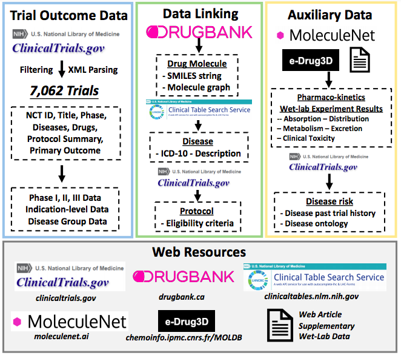

# Benchmark

To standardize the clinical trial outcome prediction, we create a benchmark dataset for Trial Outcome Prediction named TOP, which incorporate rich data components about clinical trials, including drug, disease and protocol (eligibility criteria). 
Benchmark can be mainly divided into two parts:
- `Raw Data` describes all the data sources. 
  - [`ClinicalTrial.gov`](https://clinicaltrials.gov): all the clinical trials records. 
  - [`DrugBank`](https://go.drugbank.com/): molecule structures of all the drugs. 
  - [`ClinicalTable`](https://clinicaltables.nlm.nih.gov/): API for ICD-10 codes. 
  - [`MoleculeNet`](https://moleculenet.org/): ADMET data. 
- `Data Curation Process` describes data curation process.
  - Collect all the records
  - diseases to icd10 
  - drug to SMILES 
  - ICD-10 code hierarchy
  - Sentence Embedding for trial protocol 
  - Selection criteria of clinical trial
  - Data split 
- Tutorial 

## Raw Data 

### ClinicalTrial.gov
- description
  - We download all the clinical trials records from [ClinicalTrial.gov](https://clinicaltrials.gov/AllPublicXML.zip). The processed data are based on ClinicalTrials.gov database on Feb 20, 2021. It contains 348,891 clinical trial records. The data size grows with time because more clinical trial records are added. It describes many important information about clinical trials, including NCT ID (i.e.,  identifiers to each clinical study), disease names, drugs, brief title and summary, phase, criteria, and statistical analysis results. 
  - **Outcome labels** are provided by **IQVIA**. 

- output
  - `./raw_data`: store all the xml files for all the trials (identified by NCT ID).  

<!-- When the `p-value` is smaller than 0.05, we take it as positive sample. Please see `benchmark/pseudolabel.py`.  -->


```bash 
mkdir -p raw_data
cd raw_data
wget https://clinicaltrials.gov/AllPublicXML.zip
```


Then we unzip the ZIP file. The unzipped file occupies over 8.6 G. Please make sure you have enough space. 
```bash 
unzip AllPublicXML.zip
cd ../
```

### DrugBank

- description
  - We use [DrugBank](https://go.drugbank.com/) to get the molecule structures ([SMILES](https://en.wikipedia.org/wiki/Simplified_molecular-input_line-entry_system), simplified molecular-input line-entry system) of the drug. 

- input
  - None 

- output
  - `data/drugbank_drugs_info.csv `  

### ClinicalTable

[ClinicalTable](https://clinicaltables.nlm.nih.gov/) is a public API to convert disease name (natural language) into ICD-10 code. 

### MoleculeNet
- description
  - [MoleculeNet](https://moleculenet.org/) include five datasets across the main categories of drug pharmaco-kinetics (PK). For absorption, we use the bioavailability dataset. For distribution, we use the blood-brain-barrier experimental results provided. For metabolism, we use the CYP2C19 experiment paper, which is hosted in the PubChem biassay portal under AID 1851. For excretion, we use the clearance dataset from the eDrug3D database. For toxicity, we use the ToxCast dataset, provided by MoleculeNet. We consider drugs that are not toxic across all toxicology assays as not toxic and otherwise toxic. 

- input
  - None 

- output 
  - `data/ADMET`

---

## Data Curation Process 

### Collect all the records
- description
  - download all the records from clinicaltrial.gov. The current version has 370K trial IDs. 

- input
  - `raw_data/`: raw data, store all the xml files for all the trials (identified by NCT ID).   

- output
  - `data/all_xml`: store NCT IDs for all the xml files for all the trials.  

```bash
find raw_data/ -name NCT*.xml | sort > data/all_xml
```


### Disease to ICD-10 code

- description

  - The diseases in [ClinicalTrialGov](clinicaltrials.gov) are described in natural language. 

  - On the other hand, [ICD-10](https://en.wikipedia.org/wiki/ICD-10) is the 10th revision of the International Statistical Classification of Diseases and Related Health Problems (ICD), a medical classification list by the World Health Organization (WHO). It leverages the hierarchical information inherent to medical ontologies. 

  - We use [ClinicalTable](https://clinicaltables.nlm.nih.gov/), a public API to convert disease name (natural language) into ICD-10 code. 

- input 
  - `raw_data/ ` 
  - `data/all_xml`   

- output
  -	`data/diseases.csv ` 

It takes around 2 hours. 

```bash 
python benchmark/collect_disease_from_raw.py
```


### drug to SMILES 

- description
  - [SMILES](https://en.wikipedia.org/wiki/Simplified_molecular-input_line-entry_system) is simplified molecular-input line-entry system of the molecule. 

  - The drugs in [ClinicalTrialGov](clinicaltrials.gov) are described in natural language. 

  - [DrugBank](https://go.drugbank.com/) contains rich information about drugs. 

  - We use [DrugBank](https://go.drugbank.com/) to get the molecule structures in terms of SMILES. 

- input
  - `data/drugbank_drugs_info.csv `  

- output
  - `data/drug2smiles.pkl `  

```bash
python benchmark/drug2smiles.py 
```


### Selection criteria of clinical trial

We design the following inclusion/exclusion criteria to select eligible clinical trials for learning. 

- inclusion criteria 
  - study-type is interventional 
  - intervention-type is small molecules drug
  - it has outcome label
  <!-- - p-value in primary-outcome is available -->
  - disease codes are available 
  - drug molecules are available 
  <!-- - eligibility criteria are available -->


- exclusion criteria 
  - study-type is observational 
  - intervention-type is surgery, biological, device
  - outcome label is not available 
  <!-- - p-value in primary-outcome is not available -->
  - disease codes are not available 
  - drug molecules are not available 
  <!-- - eligibility criteria are not available -->

The csv file contains following features:

* `nctid`: NCT ID, e.g., NCT00000378, NCT04439305. 
* `status`: `completed`, `terminated`, `active, not recruiting`, `withdrawn`, `unknown status`, `suspended`, `recruiting`. 
<!-- * `why_stop`: for completed, it is empty. Otherwise, the common reasons contain `slow/low/poor accrual`, `lack of efficacy` -->
* `label`: 0 (failure) or 1 (success).  
* `phase`: I, II, III or IV. 
* `diseases`: list of diseases. 
* `icdcodes`: list of icd-10 codes.
* `drugs`: list of drug names
* `smiless`: list of SMILES
* `criteria`: egibility criteria 

- input    
  - `data/diseases.csv ` 
  - `data/drug2smiles.pkl`  
  - `data/all_xml ` 

- output 
  - `data/raw_data.csv` 


```bash
python benchmark/collect_raw_data.py | tee data_process.log 
```


```bash
python benchmark/nctid2date.py 
```

- input
  - 'data/raw_data.csv'
  - './raw_data'

- output 
  - 'data/nctid_date.txt'


<!-- <p align="center"></p> -->


### Data Split 
- description (Split criteria)
  - phase I: phase I trials
  - phase II: phase II trials
  - phase III: phase III trials
- input
  - `data/raw_data.csv` 

- output: 
  - `data/phase_I_{train/valid/test}.csv` 
  - `data/phase_II_{train/valid/test}.csv` 
  - `data/phase_III_{train/valid/test}.csv` 


```bash
python benchmark/data_split.py 
```


### ICD-10 code hierarchy 

- description 
  - get all the ancestor code for the current icd-10 code. 

- input
  - `data/raw_data.csv` 

- output: 
  - `data/icdcode2ancestor_dict.pkl` 


```bash 
python benchmark/icdcode_encode.py 
```

### Sentence embedding 

- description 
  - BERT embedding to get sentence embedding for sentence in clinical protocol. 

- input
  - `data/raw_data.csv` 

- output: 
  - `data/sentence2embedding.pkl` 


```bash 
python benchmark/protocol_encode.py 
```


## Tutorial 

We provide a jupyter notebook tutorial in `tutorial_benchmark.ipynb` (in the main folder), which describes some key components of the data curation process. 


## Contact

Please contact futianfan@gmail.com for help or submit an issue. This is a joint work with [Kexin Huang](https://www.kexinhuang.com/), [Cao(Danica) Xiao](https://sites.google.com/view/danicaxiao/), Lucas M. Glass and [Jimeng Sun](http://sunlab.org/). 


## Benchmark Usage Agreement

The benchmark dataset and code (including data collection and preprocessing, model construction, learning process, evaluation), referred as the Works, are publicly available for Non-Commercial Use only at https://github.com/futianfan/clinical-trial-outcome-prediction. Non-Commercial Use is defined as for academic research or other non-profit educational use which is: (1) not-for-profit; (2) not conducted or funded (unless such funding confers no commercial rights to the funding entity) by an entity engaged in the commercial use, application or exploitation of works similar to the Works; and (3) not intended to produce works for commercial use.


